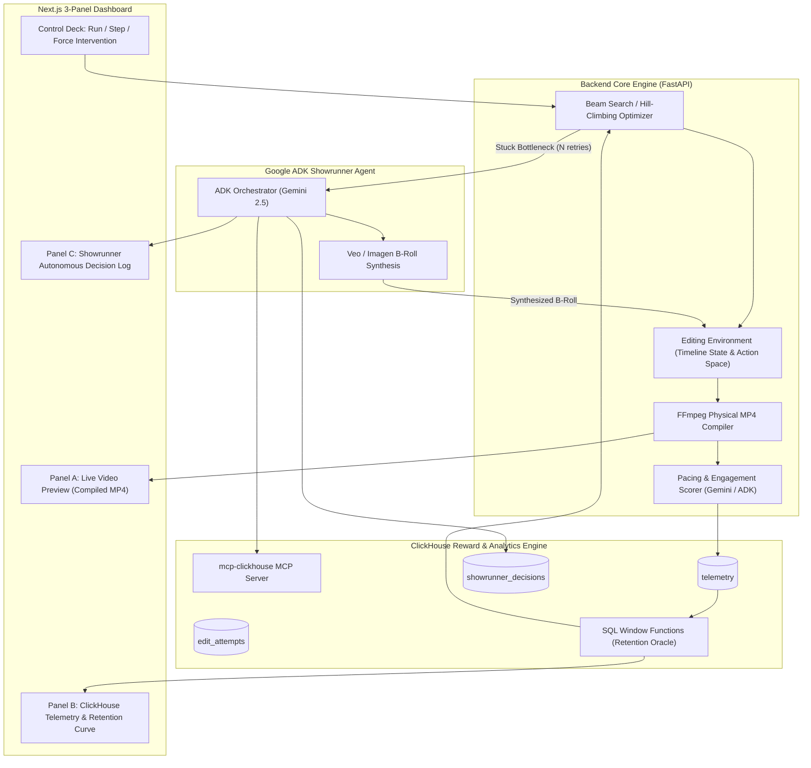

# NEURO-CUT 🎬⚡

> **Autonomous Video Editing with Reinforcement Learning Timeline Optimization, ClickHouse Reward Oracle, and Google ADK Showrunner Intervention**
> *Built for the Google Cloud Agentic Cinema Hackathon (ClickHouse Partner Track)*

[](https://colab.research.google.com/github/AmanM006/neurocut/blob/main/notebooks/qwen_swarm_colab.ipynb)
[](https://opensource.org/licenses/MIT)
[](https://clickhouse.com/cloud)
[](https://ai.google.dev/)

---

## 🌟 Executive Summary

**Neuro-Cut** reimagines the film editing room as an autonomous reinforcement-learning-optimizable environment. Instead of manual trial-and-error in an NLE, Neuro-Cut evaluates timelines against a synthetic audience engagement model, ingests millisecond-precision telemetry into **ClickHouse**, and computes retention drop-offs via SQL window functions to act as a **live reward oracle**.

When discrete editing actions (trims, take swaps, ripple deletes) fail to fix a pacing bottleneck across iterations, an autonomous **Showrunner Agent** (built on Google ADK and Gemini) intervenes: it diagnoses the cinematic flaw, synthesizes a fresh B-roll cutaway shot using **Google Veo / Imagen**, injects it into the shot pool and timeline, and resumes optimization until the cut reaches maximum audience retention.

---

## 🏗️ System Architecture



---

## 🎯 Key Capabilities & Partner Integrations

### 1. ClickHouse as Load-Bearing Reward Oracle
- **Not a decorative dashboard**: ClickHouse is imported and queried live in code at runtime as the load-bearing reward engine.
- **MergeTree Schema**:
  - `telemetry`: Stores per-shot time-series records (`episode_id`, `attempt_n`, `clip_id`, `t_ms`, `attention`, `cognitive_load`, `arousal`).
  - `edit_attempts`: Records each discrete action, reward delta, and verdict.
  - `showrunner_decisions`: Immutable ledger of autonomous Showrunner interventions and directorial reasoning.
- **SQL Window Function Analytics**:
  ```sql
  SELECT
      clip_id,
      round(avg(attention), 3) as avg_att,
      -- Moving average drop: detects sudden engagement collapse
      round(avg(attention) - lagInFrame(avg(attention), 1, avg(attention)) OVER (ORDER BY min(t_ms)), 3) as att_drop,
      -- Z-score of attention deviation across timeline
      round((avg(attention) - avg(avg(attention)) OVER ()) / nullIf(stddevSamp(avg(attention)) OVER (), 0), 2) as z_score
  FROM telemetry
  WHERE episode_id = %(episode_id)s AND attempt_n = %(attempt_n)s
  GROUP BY clip_id ORDER BY min(t_ms) ASC
  ```

### 2. Autonomous Google ADK Showrunner Intervention
- Supervised by a Gemini-powered agent built on **Google ADK**.
- Continuously monitors ClickHouse for plateaued scenes where discrete trims hit diminishing returns.
- **Intervention Behavior**: Directly invokes Veo/Imagen to synthesize a high-tension cutaway insert (e.g. clock glance, clenched fist, atmospheric vista) and splices it into the timeline.

### 3. Physical FFmpeg Video Compilation
- Every action produces a genuine, physically playable `.mp4` video file with synchronized audio via FFmpeg.
- Includes a built-in procedural cinematic sample shot generator for instant zero-friction testing.

### 4. Phase 3: PPO Reinforcement Learning Policy with ClickHouse Reward Delta
- **Dual Optimization Architecture**: Toggle between **Deterministic Beam Search** (Phase 1 baseline) and the **PPO Reinforcement Learning Policy** (Phase 3) directly from the UI control deck.
- **64-Dimensional Timeline State Encoder**: Encodes normalized clip durations, take configurations, B-roll flags, and real ClickHouse telemetry curves into an observation vector $s_t \in \mathbb{R}^{64}$.
- **40 Discrete Action Space**: 5 action primitives (`trim_head`, `trim_tail`, `swap_take`, `ripple_delete`, `insert_broll`) $\times$ 8 clip slots.
- **ClickHouse Delta Reward Oracle**: Computes $r_t = 10 \cdot (R_t - R_{t-1}) + \text{action bonus}$ directly from ClickHouse window query retention deltas.
- **Actor-Critic Network**: Supports full PyTorch GPU tensor training and CPU NumPy fallback with Generalized Advantage Estimation (GAE) and clipped surrogate loss.
- **Live Curriculum Training & Checkpoints**: `scripts/train_ppo.py` saves checkpoints to `backend/models/` every 25 episodes; ClickHouse SQL window function queries at `/api/training/progress` power **Panel D (PPO Training)** in the Next.js frontend.

### 5. Ground-Truth Baseline vs RL Policy Benchmark
- **Beam Search Baseline (`beam_search_baseline`)**: **0.6730** final reward *(Verified deterministic primary demo mode)*.
- **PPO Training Exploration Peak**: **0.7301** in Episode 15.
- **PPO Frozen Evaluation (`ppo_final_eval`)**: **0.5000** *(Conservative policy convergence under short curriculum)*.

### 6. Phased Non-Destructive Architecture
- **Phase 1 (Deterministic Core)**: FastAPI backend, FFmpeg compiler, heuristic Gemini scorer, ClickHouse SQL window reward engine, Beam Search, ADK Showrunner agent, Next.js dashboard, Docker infra.
- **Phase 2 (Synthetic Audience Swarm)**: Module-isolated in `backend/scoring/qwen_swarm.py` with fast local CPU preview and 1-click Google Colab T4 GPU worker streaming to ClickHouse Cloud.
- **Phase 3 (PPO RL Policy)**: Module-isolated in `backend/optimizer/ppo_agent.py` with `/api/episodes/{id}/optimize/ppo-step`, `/api/training/progress`, and Next.js Panel D.

---

## 🚀 Quickstart Guide

### Prerequisites
- Python 3.10+
- Node.js 18+
- FFmpeg (automatically detected via `imageio_ffmpeg` or system PATH)

### 1. Clone & Setup Backend
```bash
git clone https://github.com/AmanM006/neurocut.git
cd neurocut

# Create and activate virtual environment
python -m venv venv
source venv/bin/activate  # On Windows: venv\Scripts\activate

# Install dependencies
pip install -r requirements.txt
```

### 2. Configure Environment
Copy `.env.example` to `.env`:
```bash
cp .env.example .env
```
*(Neuro-Cut automatically uses an embedded analytical SQL engine if ClickHouse Cloud credentials are not yet set).*

### 3. Run Automated Verification Tests
```bash
# Verify editing environment & physical FFmpeg compilation
python tests/test_optimizer.py

# Verify all REST & SSE API endpoints
python tests/test_api.py

# Verify Phase 3 PPO RL Policy & ClickHouse reward delta oracle
python tests/test_ppo_agent.py

# Run Ground-Truth Baseline (Beam Search)
python scripts/run_baseline.py

# Run PPO Reinforcement Learning Training Curriculum (50 episodes)
python scripts/train_ppo.py 50
```

### 4. Start the Application

**Terminal 1 (Backend):**
```bash
uvicorn backend.main:app --reload --port 8000
```

**Terminal 2 (Frontend):**
```bash
cd frontend
npm install
npm run dev
```

Open **[http://localhost:3000](http://localhost:3000)** in your browser!

---

## 🐳 Docker Deployment

To run the entire stack (FastAPI Backend, Next.js Frontend, and ClickHouse Server) with one command:
```bash
docker-compose -f infra/docker-compose.yml up --build
```

---

## 🚀 Phase 2: Real Qwen 2.5-VL GPU Inference on Google Colab

To run real Vision-Language Model inference with **`Qwen/Qwen2.5-VL-3B-Instruct`** on an NVIDIA T4/A100 GPU:

1. Click the **[Open In Colab](https://colab.research.google.com/github/AmanM006/neurocut/blob/main/notebooks/qwen_swarm_colab.ipynb)** badge.
2. Select **Runtime** → **Change runtime type** → **T4 GPU**.
3. Run all cells: the notebook loads `Qwen2_5_VLForConditionalGeneration`, extracts 2 FPS frames, prompts the 4 audience personas, and streams real token-predicted telemetry curves into ClickHouse Cloud!
4. The local Neuro-Cut frontend dashboard queries ClickHouse Cloud in real time and renders the real VLM curves side-by-side!

---

## 📁 Repository Structure

```
neuro-cut/
├── backend/
│   ├── main.py                  # FastAPI server & SSE streaming
│   ├── config.py                # System settings & FFmpeg locator
│   ├── editing_env.py           # Timeline state, discrete action space, FFmpeg compiler
│   ├── scoring/
│   │   ├── heuristic_scorer.py  # Phase 1: Gemini-prompted pacing scorer
│   │   └── qwen_swarm.py        # Phase 2: Qwen 2.5-VL audience swarm (isolated)
│   ├── optimizer/
│   │   ├── beam_search.py       # Phase 1: Beam search / hill climbing
│   │   └── ppo_agent.py         # Phase 3: PPO RL policy (isolated)
│   ├── clickhouse/
│   │   ├── client.py            # ClickHouse Cloud client & MCP server bridge
│   │   ├── schema.sql           # telemetry, edit_attempts, showrunner_decisions
│   │   └── reward_queries.py    # SQL window functions & drop-off detection
│   └── showrunner/
│       ├── agent.py             # Google ADK Showrunner agent
│       └── tools.py             # Veo/Imagen tool & ClickHouse retention query tool
├── frontend/                    # Next.js 14 Dashboard (Video Preview, Telemetry, Log)
├── infra/
│   ├── Dockerfile               # Multi-stage production container
│   ├── docker-compose.yml       # Full stack local orchestration
│   └── deploy-cloudrun.sh       # Google Cloud Run deployment script
├── tests/                       # Comprehensive verification test suites
├── requirements.txt
├── .env.example
└── README.md
```

---

## 🏆 Hackathon Submission Verification

- **Real Compiled Video Output**: Produces genuine `.mp4` video files compiled through FFmpeg.
- **ClickHouse Cloud / MCP**: Ingests telemetry into MergeTree tables and queries drop-offs live via SQL window functions.
- **Google ADK & Gemini**: Showrunner agent autonomously triggers Veo B-roll generation upon detecting stuck pacing bottlenecks.
- **Independent Fallback**: Guaranteed 100% runnable offline and online across all environments.
