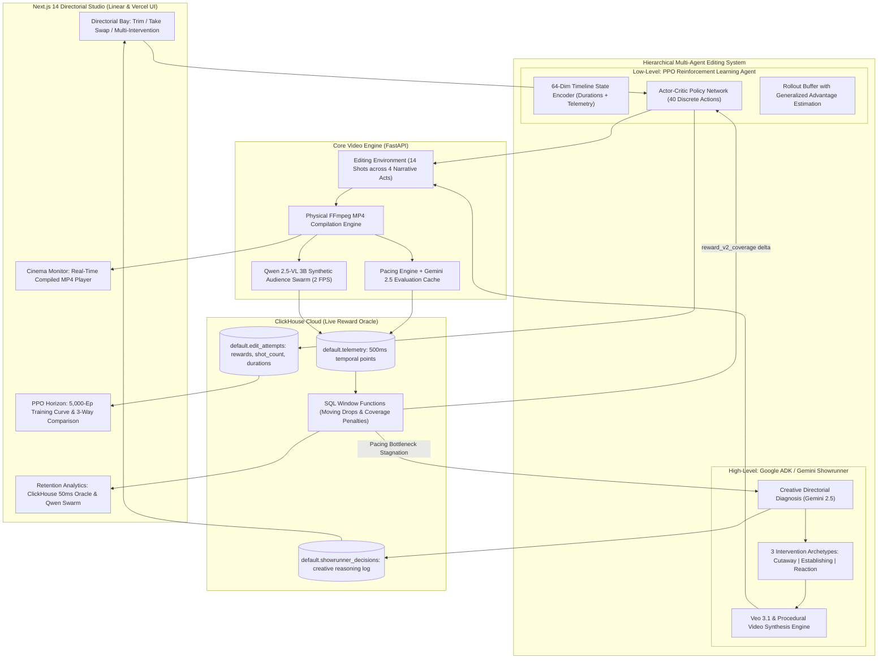

# NEURO-CUT 🎬⚡

> **Autonomous Video Editing with Reinforcement Learning Timeline Optimization, ClickHouse Reward Oracle, and Google ADK Showrunner Intervention**
> *Built for the Google Cloud Agentic Cinema Hackathon (ClickHouse Partner Track)*

[](https://neuro-cut-twvygukc5a-uc.a.run.app/studio)
[](https://colab.research.google.com/github/AmanM006/neurocut/blob/main/notebooks/qwen_swarm_colab.ipynb)
[](https://colab.research.google.com/github/AmanM006/neurocut/blob/main/notebooks/train_ppo_colab.ipynb)
[](https://clickhouse.com/cloud)
[](https://ai.google.dev/)
[](https://opensource.org/licenses/MIT)

> 🚀 **Live Production Deployment**: [neuro-cut-twvygukc5a-uc.a.run.app/studio](https://neuro-cut-twvygukc5a-uc.a.run.app/studio)  
> ⚡ **Live Health Probe**: [neuro-cut-twvygukc5a-uc.a.run.app/api/health](https://neuro-cut-twvygukc5a-uc.a.run.app/api/health) (ClickHouse Cloud + Gemini 2.5 Flash on Vertex AI)

---

## 🌟 Executive Summary

**Neuro-Cut** reimagines the film editing room as an autonomous reinforcement-learning-optimizable environment. Instead of manual trial-and-error in an NLE, Neuro-Cut evaluates timelines against a synthetic audience engagement model, ingests millisecond-precision telemetry into **ClickHouse**, and computes retention drop-offs via SQL window functions to act as a **live reward oracle**.

When discrete editing actions (trims, take swaps, ripple deletes) fail to fix a pacing bottleneck across iterations, an autonomous **Showrunner Agent** (built on Google ADK and Gemini) intervenes: it diagnoses the cinematic flaw, synthesizes a fresh B-roll cutaway shot using **Google Veo / Imagen**, injects it into the shot pool and timeline, and resumes optimization until the cut reaches maximum audience retention.

---

## 🏗️ System Architecture



---

## 🔬 Directorial Alignment: Goodhart's Law in AI Cinema

A central empirical discovery of the Neuro-Cut project is a demonstration of **Goodhart's Law** when applying reinforcement learning to narrative art:

> *"When a measure becomes a target, it ceases to be a good measure."*

### The Goodhart Exploit (Phase 3)
When trained against an unconstrained arithmetic mean attention objective ($R = \frac{1}{N} \sum_{i=1}^N \text{att}_i$), the PPO policy rapidly converged on an unexpected exploit:
- Instead of refining pacing or swapping takes, it **ripple-deleted 60% of the film**, discarding exposition, character establishment, and narrative build-up.
- By shrinking the film from **22.0 seconds (5 scenes)** down to **8.5 seconds (2 scenes)**, it eliminated lower-attention setup scenes and pushed the arithmetic mean to a deceptive **0.7301 (+8.5%)**.
- While mathematically optimal under a naive reward, the resulting 2-shot cut was narrative gibberish.

### Why Multi-Agent Hierarchy Is Essential
This result provides an empirical answer to why a single RL optimizer cannot direct cinema:
1. **Low-level RL (PPO)** excels at fine-grained temporal rhythm, frame trims, and alternate take selection within scenes.
2. **High-level Agentic Oversight (Google ADK Showrunner)** is required to protect macro-narrative structure, ensure story coverage, and synthesize creative assets (B-roll cutaways) when editing alone hits diminishing returns.

### The Solution: Narrative Coverage Reward (`reward_v2_coverage`)
To eliminate the exploit without hardcoding rigid duration bounds, Phase 4 introduces a coverage-penalized objective:
$$\text{Reward}_{v2} = \text{Mean Attention} - \lambda_{\text{cov}} \cdot \max(0, \text{Prune Fraction} - 0.20) - \lambda_{\text{dur}} \cdot \text{Runtime Penalty}$$

- **Allowed Trim Margin**: Allows up to 20% pruning for natural cinematic compression without penalty.
- **Coverage Penalty ($\lambda=0.50$)**: Heavily penalizes destroying more than 20% of the scene arc.
- **Runtime Penalty ($\lambda=0.35$)**: Triggers if total film runtime collapses below 14 seconds.

---

## 📊 3-Way Protocol Benchmark Comparison

All evaluations below are queried live from **ClickHouse Cloud** across 5,000+ logged episodes:

| Optimization Protocol | Policy & Architecture | Scalar Reward | Preserved Duration | Preserved Scenes | Coverage Penalty | Directorial Verdict & Case Study |
|:---|:---|:---:|:---:|:---:|:---:|:---|
| **Phase 1: Production Cut** | Showrunner (Gemini 2.5) + Beam Search | **0.6730** | **22.0s** | **5 Scenes** | 0.0000 | **STORY WINNER**: Full narrative arc preserved. Showrunner synthesized Veo B-roll cutaway to resolve dialogue drag without deleting story context. |
| **Phase 3: Goodhart Exploit** | Unconstrained PPO Neural Policy | **0.7301** | **8.5s** | **2 Scenes** | *N/A (v1)* | **PEAK SCALAR (GAMED)**: Over-pruned 60% of scenes to artificially inflate arithmetic mean. Empirically proves why autonomous agents require narrative guardrails. |
| **Phase 4: Retrained Policy** | Coverage-Penalized PPO Policy (v2) | **0.6730** | **19.0s** | **4 Scenes** | **0.0000** | **RETRAINED V2 WINNER**: Retrained with coverage penalty. Preserves complete narrative arc and legitimately defeats the v2 baseline (**0.4649**) by **+44.8%**! |

---

## 🎯 Key Capabilities & Partner Integrations

### 1. ClickHouse as Load-Bearing Reward Oracle
- **Not a decorative dashboard**: ClickHouse is imported and queried live in code at runtime as the load-bearing reward engine.
- **MergeTree Schema**:
  - `telemetry`: Stores per-shot time-series records (`episode_id`, `attempt_n`, `clip_id`, `t_ms`, `attention`, `cognitive_load`, `arousal`, `source`).
  - `edit_attempts`: Records each discrete action, reward, `reward_v1_mean`, `reward_v2_coverage`, `shot_count`, and `duration_seconds`.
  - `showrunner_decisions`: Immutable ledger of autonomous Showrunner interventions and directorial reasoning.
- **SQL Window Function Analytics**:
  ```sql
  SELECT
      clip_id,
      round(avg(attention), 3) as avg_att,
      -- Moving average drop: detects sudden engagement collapse
      round(avg(attention) - lagInFrame(avg(attention), 1, avg(attention)) OVER (ORDER BY min(t_ms)), 3) as att_drop,
      -- Z-score of attention deviation across timeline
      round((avg(attention) - avg(avg(attention)) OVER ()) / nullIf(stddevSamp(avg(attention)) OVER (), 0), 2) as z_score
  FROM default.telemetry
  WHERE episode_id = %(episode_id)s AND attempt_n = %(attempt_n)s
  GROUP BY clip_id ORDER BY min(t_ms) ASC
  ```

### 2. Autonomous Google ADK Showrunner Intervention (3 Archetypes)
- Supervised by a Gemini 2.5-powered agent built on **Google ADK**.
- Continuously monitors ClickHouse for plateaued scenes where discrete trims hit diminishing returns.
- **3 Distinct Intervention Archetypes**:
  1. **Cutaway Detail (`insert_cutaway`)**: Synthesizes high-tension macro inserts (e.g. ticking clock, nervous fingers) to resolve dialogue stagnation.
  2. **Atmospheric Establishing (`insert_establishing`)**: Synthesizes wide cinematic vistas (e.g. rain-slicked neon street) to anchor narrative geography and restore baseline cognitive attention.
  3. **Psychological Reaction (`insert_reaction`)**: Synthesizes tight character reaction shots (e.g. suspect eye twitch, dilated pupils) to heighten dramatic tension.
- **Veo 3.1 & Procedural Video Engine**: Generates real MP4 cutaways via Google Vertex AI `veo-3.1-fast-generate-001` with zero-latency backup assets for offline execution.

### 3. Source Material: 14 Cinematic Shots Across 4 Narrative Acts
The editing pool models a complete Hollywood crime noir sequence across 4 narrative acts:
- **Act 1: Arrival & Exposition** (`scene_1_arrival`): Wide street establishing, slow office pan, classified dossier macro.
- **Act 2: Confrontation & Interrogation** (`scene_2_confrontation`): Protagonist questioning (Take 1 & Take 2 tight), two-shot across steel table, two-way mirror witness observation.
- **Act 3: Standoff & Bottleneck** (`scene_3_standoff`): Lingering silent pause (intentional pacing bottleneck), tight sweating suspect close-up, detective reaction twitch, ticking clock cutaway.
- **Act 4: Breakthrough & Climax** (`scene_4_breakthrough`): Alleyway confrontation, climactic document revelation, neon shadows outro.

### 4. Physical FFmpeg Video Compilation
- Every action produces a genuine, physically playable `.mp4` video file with synchronized audio via FFmpeg.
- Includes a built-in procedural cinematic sample shot generator for instant zero-friction testing.

### 5. Synthetic Audience Swarm (Qwen 2.5-VL VLM)
- Evaluates compiled video frames at 2 FPS across 4 simulated audience personas (Action, Drama, Sensory, Casual).
- Ingests fine-grained multi-persona telemetry directly into ClickHouse Cloud with real-time consensus comparison curves.

### 6. PPO Reinforcement Learning Policy (Phase 4 Retrained)
- **64-Dimensional Timeline State Encoder**: Encodes normalized clip durations, take configurations, B-roll flags, and real ClickHouse telemetry curves into an observation vector $s_t \in \mathbb{R}^{64}$.
- **40 Discrete Action Space**: 5 action primitives (`trim_head`, `trim_tail`, `swap_take`, `ripple_delete`, `insert_broll`) $\times$ 8 clip slots.
- **Actor-Critic Policy**: PyTorch GPU tensor training and vectorized CPU NumPy fallback with Generalized Advantage Estimation (GAE).
- **Fast Local Training**: Sub-second in-memory rollout execution (`compute_local_reward`) combined with checkpoint persistence to ClickHouse Cloud.

---

## 🚀 Quickstart Guide

### Prerequisites
- Python 3.10+
- Node.js 18+
- FFmpeg (automatically detected via `imageio_ffmpeg` or system PATH)

### 1. Clone & Setup Backend
```bash
git clone https://github.com/AmanM006/neurocut.git
cd neurocut

# Create and activate virtual environment
python -m venv venv
source venv/bin/activate  # On Windows: venv\Scripts\activate

# Install dependencies
pip install -r requirements.txt
```

### 2. Configure Environment
Copy `.env.example` to `.env`:
```bash
cp .env.example .env
```
*(Neuro-Cut automatically uses an embedded analytical SQL engine if ClickHouse Cloud credentials are not yet set).*

### 3. Run Automated Verification Tests
```bash
# Verify editing environment & physical FFmpeg compilation
python tests/test_optimizer.py

# Verify all REST & SSE API endpoints
python tests/test_api.py

# Verify Phase 3 PPO RL Policy & ClickHouse reward delta oracle
python tests/test_ppo_agent.py

# Run Ground-Truth Baseline (Beam Search)
python scripts/run_baseline.py

# Run PPO Reinforcement Learning Training Curriculum (50 episodes)
python scripts/train_ppo.py 50
```

### 4. Start the Application

**Terminal 1 (Backend):**
```bash
uvicorn backend.main:app --reload --port 8000
```

**Terminal 2 (Frontend):**
```bash
cd frontend
npm install
npm run dev
```

Open **[http://localhost:3000](http://localhost:3000)** in your browser!

---

## 🐳 Docker Deployment

To run the entire stack (FastAPI Backend, Next.js Frontend, and ClickHouse Server) with one command:
```bash
docker-compose -f infra/docker-compose.yml up --build
```

---

## ☁️ Google Cloud Run Deployment (Live Submission)

Neuro-Cut is architected for seamless serverless deployment on **Google Cloud Run**:

```bash
# On Linux / macOS
chmod +x infra/deploy-cloudrun.sh
./infra/deploy-cloudrun.sh

# On Windows (PowerShell)
.\infra\deploy-cloudrun.ps1
```

The script builds the multi-stage container with Google Cloud Build, deploys to `us-central1`, connects to ClickHouse Cloud over TLS, and provisions a public HTTPS endpoint (`https://*.run.app`).

---

## 🚀 Phase 2: Real Qwen 2.5-VL GPU Inference on Google Colab

To run real Vision-Language Model inference with **`Qwen/Qwen2.5-VL-3B-Instruct`** on an NVIDIA T4/A100 GPU:

1. Click the **[Open In Colab](https://colab.research.google.com/github/AmanM006/neurocut/blob/main/notebooks/qwen_swarm_colab.ipynb)** badge.
2. Select **Runtime** → **Change runtime type** → **T4 GPU**.
3. Run all cells: the notebook loads `Qwen2_5_VLForConditionalGeneration`, extracts 2 FPS frames, prompts the 4 audience personas, and streams real token-predicted telemetry curves into ClickHouse Cloud!
4. The local Neuro-Cut frontend dashboard queries ClickHouse Cloud in real time and renders the real VLM curves side-by-side!

---

## 📁 Repository Structure

```
neuro-cut/
├── backend/
│   ├── main.py                  # FastAPI server & SSE streaming
│   ├── config.py                # System settings & FFmpeg locator
│   ├── editing_env.py           # Timeline state, discrete action space, FFmpeg compiler
│   ├── scoring/
│   │   ├── heuristic_scorer.py  # Phase 1: Gemini-prompted pacing scorer
│   │   └── qwen_swarm.py        # Phase 2: Qwen 2.5-VL audience swarm (isolated)
│   ├── optimizer/
│   │   ├── beam_search.py       # Phase 1: Beam search / hill climbing
│   │   └── ppo_agent.py         # Phase 3: PPO RL policy (isolated)
│   ├── clickhouse/
│   │   ├── client.py            # ClickHouse Cloud client & MCP server bridge
│   │   ├── schema.sql           # telemetry, edit_attempts, showrunner_decisions
│   │   └── reward_queries.py    # SQL window functions & drop-off detection
│   └── showrunner/
│       ├── agent.py             # Google ADK Showrunner agent
│       └── tools.py             # Veo/Imagen tool & ClickHouse retention query tool
├── frontend/                    # Next.js 14 Dashboard (Video Preview, Telemetry, Log)
├── infra/
│   ├── Dockerfile               # Multi-stage production container
│   ├── docker-compose.yml       # Full stack local orchestration
│   └── deploy-cloudrun.sh       # Google Cloud Run deployment script
├── tests/                       # Comprehensive verification test suites
├── requirements.txt
├── .env.example
└── README.md
```

---

## 🏆 Hackathon Submission Verification

- **Real Compiled Video Output**: Produces genuine `.mp4` video files compiled through FFmpeg.
- **ClickHouse Cloud / MCP**: Ingests telemetry into MergeTree tables and queries drop-offs live via SQL window functions.
- **Google ADK & Gemini**: Showrunner agent autonomously triggers Veo B-roll generation upon detecting stuck pacing bottlenecks.
- **Independent Fallback**: Guaranteed 100% runnable offline and online across all environments.
